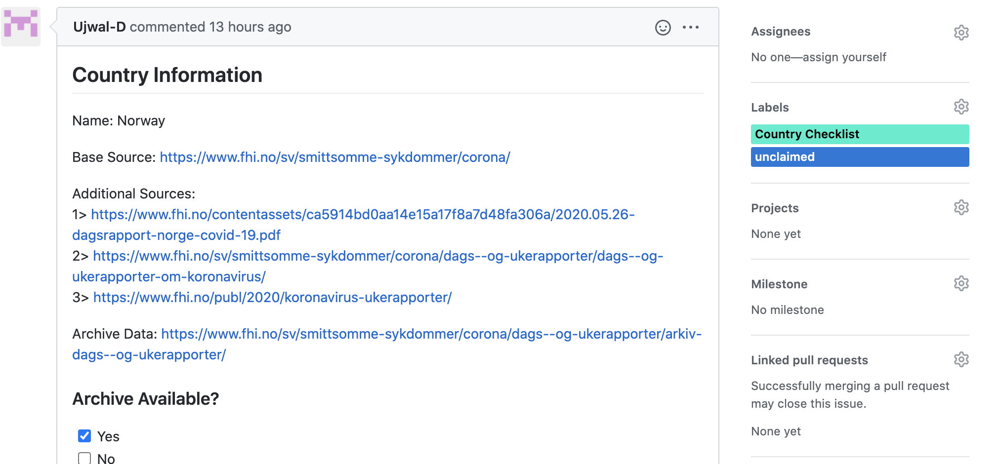

# Globalhealth 50/50 - COVID-19 Data tracker

Global Health 50/50 is an independent, evidence-driven initiative to advance action and accountability for gender equality in global health. The collective and it's work can only be deemed a success when global health policy and organisational decision-making puts a gender lens, gender equality and health equity at the core of all it does.


From the first reports of the novel coronavirus, COVID-19, there has been consistent evidence of a gendered impact on health outcomes.
This tool to automates data fetching for COVID-19 by country, including gender disparities in reporting, testing, and outcomes.

<!-- ## Project Features

* [covid_data_tracker](http://GH5050_COVID_Data_Tracker.readthedocs.io/) -->

- [Globalhealth 50/50 - COVID-19 Data tracker](#globalhealth-5050---covid-19-data-tracker)
- [Elements](#elements)
  * [CLI](#cli)
  * [BasePlugin](#baseplugin)
  * [PluginRegistry](#pluginregistry)
  * [Country Plugins](#country-plugins)
- [Areas to contribute](#areas-to-contribute)
  * [Overall strategy](#overall-strategy)
  * [Country Plugins (see plugin section below)](#country-plugins-see-plugin-section-below)
  * [Validation](#validation)
  * [Core Project](#core-project)
- [Country Plugins](#country-plugins-1)
- [Scraping Strategies](#scraping-strategies)
- [Additional Information](#additional-information)
  * [TODO](#todo)
  * [Resources](#resources)
  * [Authors](#authors)
  * [License](#license)

# Elements

## CLI

covid_data_tracker provides a command line application `covidtracker`:

```
covidtracker
Usage: covidtracker [OPTIONS] COMMAND [ARGS]...

 Run covidtracker.

Options:
 -v, --verbose  Enable verbose output.
 --help         Show this message and exit.

Commands:
 download  Download country level statistics.
 info      Get country level information on sources and download strategy.
 list      List all countries for which a plugin is available.
 version   Get the library version.
```


The project's documentation contains a section to help you
[get started](https://GH5050_COVID_Data_Tracker.readthedocs.io/en/latest/getting_started.html) as a developer or user of the library.
(coming soon)


## BasePlugin

The [BasePlugin](https://github.com/granularai/gh5050_covid_data_tracker/blob/sex-disaggregated-reporting/covid_data_tracker/plugins/base.py) is the parent class for all Country level plugins and is responsible for:

1. Defining the metadata needed for each country
2. Creating the PluginRegistry that keeps track of all child plugins (using subclasses)
3. Defining the data table that the plugins populate
4. Managing CLI download and info requests
5. Populating and resturcturing  country data from a pandas dataframe to a single row

## PluginRegistry

The [PluginRegistry](https://github.com/granularai/gh5050_covid_data_tracker/blob/sex-disaggregated-reporting/covid_data_tracker/registry.py) keeps track of plugins available in [gh5050_covid_data_tracker/covid_data_tracker/plugins/countries/](https://github.com/granularai/gh5050_covid_data_tracker/tree/sex-disaggregated-reporting/covid_data_tracker/plugins/countries) for lookup by the CLI tool.

## Country Plugins

Country Plugins (eg [CzechRepublicPlugin.py](https://github.com/granularai/gh5050_covid_data_tracker/blob/sex-disaggregated-reporting/covid_data_tracker/plugins/countries/CzechRepublicPlugin.py)) inherit BasePlugin and are responsible for defining country-specific scraping logic as well as static and capture specific metadata.

# Areas to contribute
We encourage people to participate in the development of country plugins and reviewing the reliability of existing plugins.  If you are interested in contributing, please find [an available source checklist template](https://github.com/granularai/gh5050_covid_data_tracker/issues?page=1&q=is%3Aopen+is%3Aissue+label%3A%22Country+Checklist%22) or create your own if your country is not listed (this prevents effort duplication).

If you are interested in collaborating or contributing please see areas where we need help below.  If you would like to connect, please reach out to us at team@granular.ai.

## Overall strategy

If you have experience with web scraping or generally have advice for us on ways to restructure the project, please let us know!

## Country Plugins (see plugin section below)

The fastest way to start contributing is to build a country plugin:

1. Go to issues section and find a [country checklist](https://github.com/granularai/gh5050_covid_data_tracker/issues?page=1&q=is%3Aopen+is%3Aissue+label%3A%22Country+Checklist%22) that has not yet been claimed
2. add a "claimed" tag to the country checklist

    

3. Create a branch or fork of this project
4. Add a country plugin module to plugins folder.

eg - `/covid_data_tracker/plugins/countries/PeruPlugin.py`

 5.  Create a class with the same name as module and begin developing the scraping logic under `fetch()`. We expand on country plugins below.

 6.  Once your fetch method populates the full sex_table, please push to github and submit a PR!

 7. We will review your approach and, provided everything works, we will add it to the production branch!

## Validation

It is critical that the data we produce be reliable. Therefore we need to introduce sophisticated validation to assess the integrity of country-level plugins and reliability of our logical calculations.

- Can we tell if the source format has changed? Does this impact our ability to scrape the source?
    - Has the page / pdf layout changed?
    - Have table locations changed (relevant for tabula)?
    - Has the content of column of row indexes changed?
    - Is reporting consistent?
- Are the calculations and "prioritization strategies" in BasePlugin sensible?

## Core Project

- testing for CLI, methods, base class
- expansion (API, Frontend)
- docs
- scraping mixins and utilities

# Country Plugins

Country Plugins are the core element of this project and must be developed for each country with COVID.  Here is how you can create one.

1. Start by adding a module to `/covid_data_tracker/plugins/countries/` with the name of your country in a separate branch or fork of this project (stable branch).

    eg:  `/covid_data_tracker/plugins/countries/AtlantisPlugin.py`

2. Import BasePlugin and create a child class with the **same name** of this module.  This allows us to auto-register the plugin.

    ```python
    from covid_data_tracker.plugins.base import BasePlugin

    class AtlantisPlugin(BasePlugin):
        ...
    ```

3. Add the required metadata for this plugin at the class level:

    ```python
    from covid_data_tracker.plugins.base import BasePlugin

    class AtlantisPlugin(BasePlugin):
        COUNTRY = "Atlantis"
        BASE_SOURCE = "https://atlantis.gov/covid-19/archive"
        TYPE = "PDF"
    ```

    Much of this information may already be provided in the country checklist on github issues and on the Global Health 50/50 dashboard: [https://globalhealth5050.org/covid19/sex-disaggregated-data-tracker/](https://globalhealth5050.org/covid19/sex-disaggregated-data-tracker/)

4. Additionally, please add instance level metadata that provides a snapshot of the unique source and date of capture.  The `UNIQUE_SOURCE` may be gleaned from the `BASE_SOURCE`, or, in cases where the data is fetched from a single endpoint regardless of date, this can be statically encoded.

    For example, suppose Atlantis has a list of pdfs represented in an html `<table>` and the first link is the latest.

    ```python
    import requests
    from bs4 import BeautifulSoup
    import pandas as pd
    import numpy as np
    from urllib.parse import urljoin

    from covid_data_tracker.plugins.base import BasePlugin

    class AtlantisPlugin(BasePlugin):
        COUNTRY = "Atlantis"
        BASE_SOURCE = "https://atlantis.gov/covid-19/archive"
        TYPE = "PDF"

        def __init__(self):
            super().__init__()
            base_url = 'https://atlantis.gov/'
            archive = requests.get(BASE_SOURCE)
            archive_parsed = BeautifulSoup(archive.text)
            table = archive_parsed.find_all('table')[0]
            df = pd.read_html(str(table), encoding='utf-8')[0]
            df['href'] = [np.where(tag.has_attr('href'),tag.get('href'), "no link") for tag in table.find_all('a', attrs={'class':'docman_download__button'})]
            df['href'] = [urljoin(BASE_URL, str(a)) for a in df['href']]
            self.UNIQUE_SOURCE = df.href[0]
            self.DATE = df.posted_date[0]
    ```

5. Now the fun part! Let's figure out how we can scrape the data we need.

The first thing to determine is what strategy and tools you can use to scrape data from the `UNIQUE_SOURCE`  Please see the scraping strategies section below to see a list of suggested tools and approaches depending on resource type.

implement the child class's `fetch()` method to fill in as much of the sex_table as possible.

sex_table tracks data for total, female and male.  These comprise the row indices.

sex_table has the following columns:

```python
"absolute_cases",  # the number of confirmed cases
"percent_cases",  # the percent of cases attributed to male vs female
"absolute_deaths",  # the absolute number of deaths due to COVID-19
"percent_deaths",  # the percent of deaths attributed to male vs female
"absolute_tested", # the number of people tested
"percent_tested",  # the percent of male vs female tested
"absolute_hospitalized",  # number of people hospitalized
"percent_hospitalized",  # the percent of male vs female hospitalizations
"absolute_icu_admissions",  # number of people admitted to the ICU for covid
"percent_icu_admissions",  # percent of ICU admissions attributed to male vs female
"absolute_healthcare_workers_infected",  # number of frontline healthcare workers infected
"percent_healthcare_workers_infected" # percent of healthcare workers attributed to male vs female
```

The country plugin is responsible for filling in these values. Using this page from the Czech Republic as an example...

```python
class CzechRepublicPlugin(BasePlugin):
    COUNTRY = "Czech Republic"
    BASE_SOURCE = "https://onemocneni-aktualne.mzcr.cz/covid-19"
    TYPE = "PDF"

    def __init__(self):
        ...

    def fetch(self):
        # source is a simple html page
        res = requests.get(self.UNIQUE_SOURCE) # get the source
        soup = BeautifulSoup(res.content) # use beautifulsoup to aid in html parsing
        count_value_raw = soup.findChild('p', {'id': 'count-sick'}).text
        count_value_raw = str(count_value_raw).replace(" ", "")
        self.sex_table.absolute_cases['total'] = count_value_raw
        ...
```

*NOTE: The base plugin is responsible for take the sparse table and "figuring out" what other information can be gleaned.  For instance, if you provide only `absolute_cases['total']` and `percent_cases['male']` BasePlugin is able to figure out absolute cases for male and female and percent cases that are female.  Further, if there are two values that cannot be reconciled (eg - `absolute_cases['male']` + `absolute_cases['female']` ≠ `absolute_cases['total']`), BasePlugin is responsible for determining which value makes the most sense to keep.*

# Scraping Strategies

Coming soon!

# Additional Information

## TODO

- [ ] Pull from archive data (all or date specific)
- [x] Provide information on countries (sources, update frequency, etc)
- [x] A plugin registration strategy that uses ~metaclasses~ subclasses


## Resources

* [Global Health 50/50](https://globalhealth5050.org/) is an organization that promotes gender equality in global health
* [Global Health 50/50 COVID resources and information](https://globalhealth5050.org/)
* [Granular.ai](https://granular.ai) is helping to develop this tool


## Authors

* **Sid Gupta** - *Initial work* - [github](https://github.com/granularai)

See also the list of [contributors](https://github.com/granularai/covid_data_tracker/contributors) who participated in this project.

## License

MIT License

Copyright (c) Granular.ai

Permission is hereby granted, free of charge, to any person obtaining a copy
of this software and associated documentation files (the "Software"), to deal
in the Software without restriction, including without limitation the rights
to use, copy, modify, merge, publish, distribute, sublicense, and/or sell
copies of the Software, and to permit persons to whom the Software is
furnished to do so, subject to the following conditions:

The above copyright notice and this permission notice shall be included in all
copies or substantial portions of the Software.

THE SOFTWARE IS PROVIDED "AS IS", WITHOUT WARRANTY OF ANY KIND, EXPRESS OR
IMPLIED, INCLUDING BUT NOT LIMITED TO THE WARRANTIES OF MERCHANTABILITY,
FITNESS FOR A PARTICULAR PURPOSE AND NONINFRINGEMENT. IN NO EVENT SHALL THE
AUTHORS OR COPYRIGHT HOLDERS BE LIABLE FOR ANY CLAIM, DAMAGES OR OTHER
LIABILITY, WHETHER IN AN ACTION OF CONTRACT, TORT OR OTHERWISE, ARISING FROM,
OUT OF OR IN CONNECTION WITH THE SOFTWARE OR THE USE OR OTHER DEALINGS IN THE
SOFTWARE.
